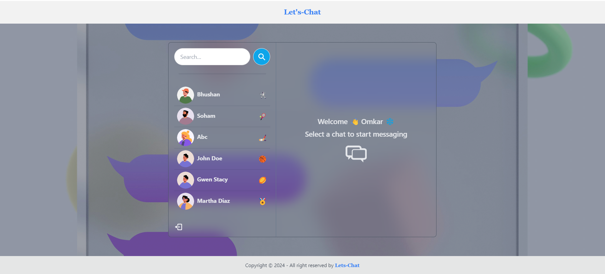

<!-- ### Setup .env file
```js
PORT=...
MONGO_DB_URI=...
JWT_SECRET=...
NODE_ENV=...
```
### Build the app
```shell
npm run build
```
### Start the app
```shell
npm start
``` -->
# Let's-Chat Application
## [Let's-Chat Live Demo](https://let-s-chat-aqud.onrender.com/)
Let's-Chat is a real-time chat application built using the MERN stack (MongoDB, Express.js, React.js, Node.js). It allows users to sign up, log in, and chat with others in real-time.

## Features
- User authentication (Sign up, Login)
- Real-time messaging with Socket.io
- Responsive UI with TailwindCSS and DaisyUI
- User-friendly chat interface

## Tech Stack
- **Frontend**: React.js, TailwindCSS, DaisyUI, Vite
- **Backend**: Node.js, Express.js, Socket.io
- **Database**: MongoDB

## Screenshots
Here are some screenshots of the application:

### Signup Page


### Login Page


### Chat Interface


## Setup Instructions

### Prerequisites
- Node.js
- MongoDB account (for cloud database)

### Installation

1. Clone the repository:
   ```bash
   git clone https://github.com/Omkarnaikwadi/Let-s-Chat.git

2. Install dependencies for the backend:
    ```bash
    cd backend
    npm install

3. Install dependencies for the frontend:
    ```bash
    cd frontend
    npm install

4. Create an .env file in the backend directory with the following variables:

    ```bash
    PORT=8000
    MONGO_DB_URI=your_mongodb_connection_uri
    JWT_SECRET=your_jwt_secret
    NODE_ENV=development

5. Run the backend server:

    ```bash
    cd backend
    nodemon server.js

6. Run the frontend server:

    ```bash
    cd frontend
    npm run dev
