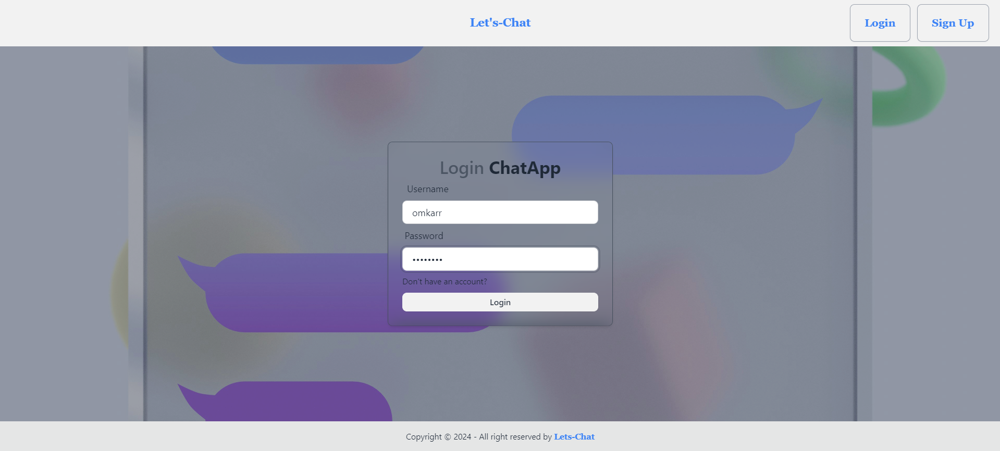
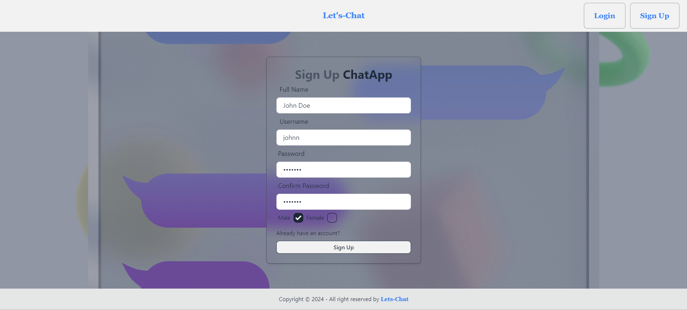

<!-- ### Setup .env file
```js
PORT=...
MONGO_DB_URI=...
JWT_SECRET=...
NODE_ENV=...
```
### Build the app
```shell
npm run build
```
### Start the app
```shell
npm start
``` -->
# Let's-Chat Application

Let's-Chat is a real-time chat application built using the MERN stack (MongoDB, Express.js, React.js, Node.js). It allows users to sign up, log in, and chat with others in real-time.

## Features
- User authentication (Sign up, Login)
- Real-time messaging with Socket.io
- Responsive UI with TailwindCSS and DaisyUI
- User-friendly chat interface

## Tech Stack
- **Frontend**: React.js, TailwindCSS, DaisyUI, Vite
- **Backend**: Node.js, Express.js, Socket.io
- **Database**: MongoDB

## Screenshots
Here are some screenshots of the application:

### Login Page


### Chat Interface


## Setup Instructions

### Prerequisites
- Node.js
- MongoDB account (for cloud database)

### Installation

1. Clone the repository:
   ```bash
   git clone https://github.com/Omkarnaikwadi/Let-s-Chat.git
